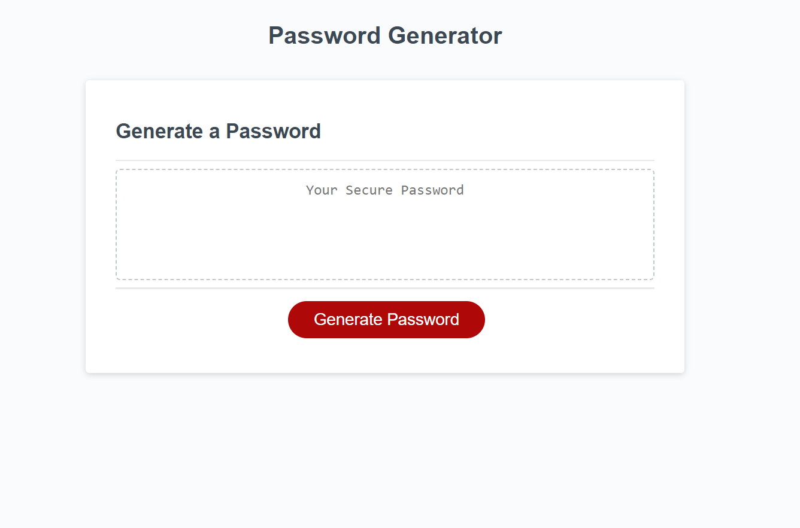
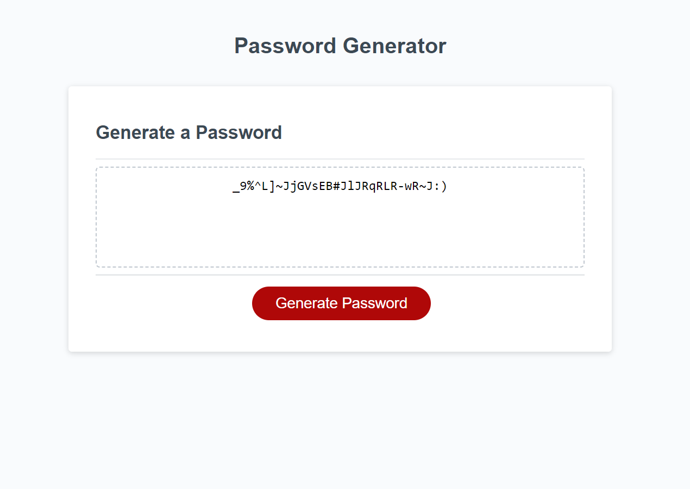

  # JavaScript Random Password Generator
  
  ## Description
  
This is a random password generator using JavaScript, HTML and CSS.

  ## Table of Contents
  - [Usage](#usage)
  - [Link](#link)
  - [Screenshots](#screenshots)
  - [License](#license)
  - [Contact](#contact)
  
  ## Usage
  Once the user clicks on the "Generate Password" button, a series of window prompts asks the user to select the following options:
  - length of the password (must be between 8 and 128 characters long)
  - lower case letters
  - upper case letters
  - numbers
  - special characters

  After all the prompts have been answered, the user's password will be generated and displayed in the text box.

  ## Link
  [Password Generator](https://jroller33.github.io/Password-Generator/)

  ## Screenshots
  ### Before Generating Password:
  

  ### After Generating Password:
  

  ## License
  This project is licensed under the [MIT License](https://www.mit.edu/~amini/LICENSE.md)

  ## Contact
  [GitHub](https://github.com/jroller33)